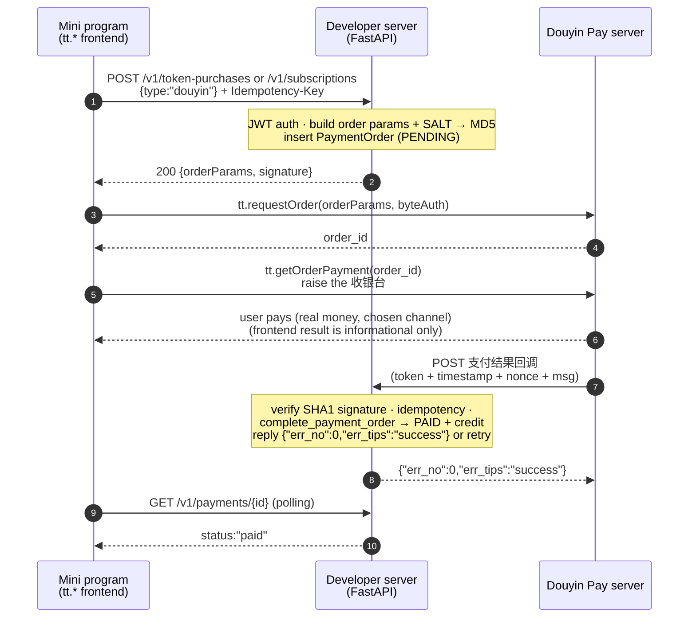
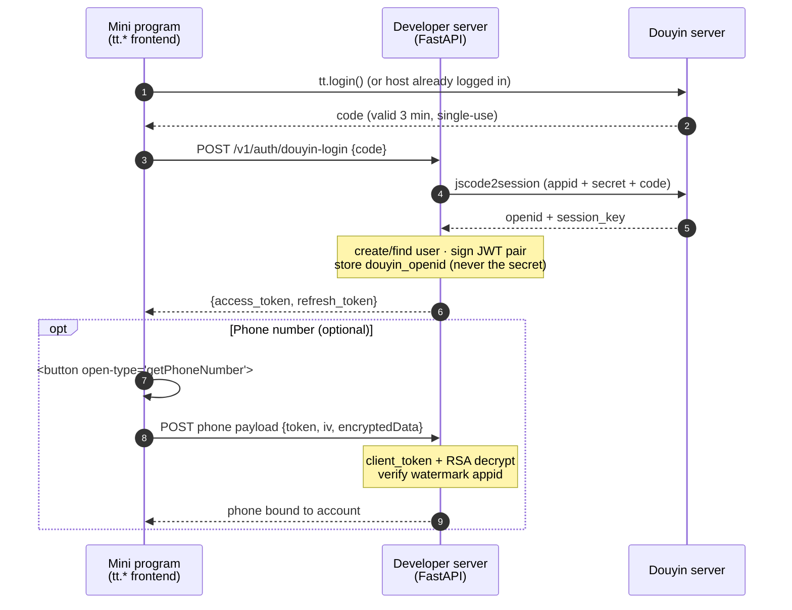

# Douyin Payment Guide (Planned)

This page is for the team wiring **Douyin Mini Program payment** into the
project. It explains what the platform requires, how Douyin's "normal vs
virtual" payment concepts differ from WeChat's, how to mock/test, and the real
end-to-end flow. It is written for developers who know the WeChat Pay
integration (see [Payment Flow](/reference/flows/payment-flow)) and need the
Douyin equivalent.

> **Status today**: Douyin **login** is live (backend `app/douyin_auth.py`,
> route `POST /v1/auth/douyin-login`; frontend `src/services/douyinAuth.ts`).
> Douyin **payment is not implemented yet**: the frontend payment bridge
> (`src/pkg-account/services/payment.ts`) still hard-codes
> `provider: "wxpay"`, and the backend has no Douyin payment code.

---

## 1. What you must apply for / configure on the Douyin Open Platform

Douyin requires a chain of prerequisites before a single payment API works:

| # | Step | Where | Notes |
|---|---|---|---|
| 1 | Register as a developer | developer.open-douyin.com | already done |
| 2 | Create the mini program | Open Platform console | already done — AppID `ttd386a53b4dfe7bf501` |
| 3 | **Subject (主体) certification** | console → settings | company certification; re-verify if expired — *missing/expired certification blocks payment* |
| 4 | Complete basic info + **service category** | console | the category decides transaction eligibility; this project is a **工具 (tool)** mini program |
| 5 | **Transaction-access eligibility** (交易准入) | see "交易能力接入规范" | category must be in the allowed list; also read 保证金 (deposit) and 订单限额 (per-order cap) rules |
| 6 | Choose a **payment solution** (进件方案) | console → 能力 → 支付 → 支付能力 | choose **企业版** (no individual-merchant payout/split) or **普通版** (involves individuals). **Cannot be changed after onboarding** |
| 7 | **Onboard a merchant** (进件) | platform page or API | 企业版 ≈ 1–3 days; 普通版 ≈ 5–7 days. Channels: Douyin + WeChat + Alipay are submitted together; Douyin itself has no extra review |
| 8 | Get the **payment SALT** | 能力 → 支付 → 支付方式管理 → 支付设置 | used to sign every server request (MD5). **Never put it in the client** |
| 9 | Apply for **capacity permissions** | 能力 → 解决方案 → 交易类小程序通用 | 通用交易系统 OpenAPI、支付消息回调、退款消息回调、退款申请扩展点… (auto-approved) |
| 10 | Configure the **callback URL** | console → 开发 → 解决方案配置 | the server address Douyin will POST payment/refund results to; then 发布上线 |

In short: for the **工具** category, Douyin officially recommends the
**通用交易系统 (General Trading System)**. Payment without completed onboarding
(进件) simply fails (`未完成进件步骤无法进行支付下单`).

## 2. Douyin "normal payment" vs "virtual payment"

Douyin uses the same two-sided model as WeChat, but the boundaries are
**stricter**:

### 现金支付 (cash payment) — the normal path

- Covers physical goods and **Android** virtual goods.
- Implemented through **担保支付 (escrow payment)** or the **通用交易系统
  (General Trading System)** — order → checkout (收银台) → callback → settle.
- The user pays real money (WeChat/Alipay/Douyin Pay channels are all
  collected through the onboarding).

### 虚拟支付 / 钻石兑换 (virtual payment / Diamond exchange) — iOS virtual goods

- Douyin's official rule (**小程序iOS虚拟支付规范**) states: **iOS does not
  support cash payment for virtual goods**. Unlocking features, memberships,
  virtual content, in-app currency on iOS **must** go through **钻石 (Diamond)
  exchange**: users top up Diamonds in their Douyin wallet and the mini program
  consumes them (10 diamonds = 1 CNY) via `tt.requestGamePayment` (Android) /
  `tt.openAwemeCustomerService` (iOS, requires IM customer-service capability).
- Doing cash payment for iOS virtual goods — or even *showing* buy buttons /
  prices on iOS without the Diamond path — is a compliance violation that can
  get the payment capability **banned**.
- **Important for this project**: Diamond exchange currently opens only for
  短剧/长视频/小说 categories; **工具 (tool) is not open yet**. So for now,
  iOS users of this app (tokens/subscriptions are virtual goods) have **no
  compliant payment channel** — plan to either gate purchases on iOS or wait
  for Diamond availability.

### How this maps to the existing WeChat code

The current code's `PaymentType` (`app` | `jsapi`) and the
"JSAPI enabled / APP backend-ready" split are **WeChat-specific**. Douyin does
not reuse those enums — the backend will need its own Douyin payment provider
with Douyin's order model (see §5).

## 3. Mock / testing: reuse WeChat's mock or use Douyin's sandbox?

**Use Douyin's official sandbox — do not reuse the WeChat mock.**

| Option | WeChat mock (existing) | Douyin sandbox (official) |
|---|---|---|
| What it is | Self-built container that *pretends* to be WeChat; SDK gateway swapped, signing/verification kept | Official environment at `open-sandbox.douyin.com`, fully isolated from production |
| Setup | docker-compose profile `mock-wechat`, `WECHAT_PAY_BASE_URL` | Create a sandbox app; onboarding ignores qualifications/audit |
| Money | no real money | **no real money**; checkout can pick result (success/timeout) |
| Callbacks | driven by `/mock/payments/{id}/complete` | sandbox posts real-shaped callbacks (only once, no retry) |
| Error injection | n/a | `Aweme-Negative-Test: <case>` header (e.g. `MA_PAY_BAN`) |
| Data retention | your own DB | 14 days; cleaned every Saturday 04:00 |
| Client | normal DevTools | **sandbox client** required (not distributable) |

Why not reuse the WeChat mock? The wire protocols are completely different —
WeChat API v3 uses JSON + certificate-based RSA signing; Douyin uses SALT +
MD5 request signing and SALT + SHA1 callback verification with an
`{err_no:0, err_tips:"success"}` acknowledgement. Reusing the mock server would
cost as much as rewriting it. Recommendation:

- **Manual/联调 testing** → Douyin sandbox (fast onboarding, no real money).
- **Automated CI testing** → only if you need offline speed; build a small
  self-hosted mock following the same idea as the WeChat one (real signing
  path, fake destination) but against Douyin's protocol.
- The **frontend confirm-text hint** already exists
  (`runtimeConfig.platform === "douyin" && paymentMode === "mock" → "模拟支付"`),
  ready for a Douyin mock bridge.

## 4. The real Douyin payment flow (end to end)

Douyin offers two shapes; the **General Trading System** is the recommended
one for the 工具 category. Both follow the same trust model as WeChat: server
signs, client pulls the checkout, platform calls back, server queries as a
backstop.

### 4a. 通用交易系统 (General Trading System) — recommended

This is the **official General Trading System sequence** (see the platform's
own diagrams in [Official documentation](#official-documentation)):

Steps for your backend:

1. **Pre-order**: build the order payload (sku/amount/`merchantUid` if
   multi-merchant), sign with SALT (MD5 of sorted non-identity field values
   joined by `&`, SALT appended). Serve it to `tt.requestOrder`, or answer the
   platform's 预下单扩展点.
2. **Checkout**: frontend calls `tt.getOrderPayment` (or the
   `payment-channel-select` component for a built-in channel list; fall back to
   `requestOrder + getOrderPayment` on component errors).
3. **Callback**: verify `signature` = SHA1(sorted(token, timestamp, nonce,
   msg)); process idempotently (by order id); reply `{"err_no":0,"err_tips":"success"}`
   or the platform retries. Because callbacks can be delayed/lost, **query the
   order as the source of truth**.
4. **Refunds**: 发起退款 API + 退款结果回调; user-initiated refunds also arrive
   through the 退款申请扩展点 and may need 审核.
5. **Settlement**: non-life-service tools settle 支付 D+7 (or 核销 D+3 with
   fulfillment). Money lands in 在途资金 → 可提现; then monthly settlement
   statements + invoice + payout.
6. **Reconciliation**: 获取交易账单 / 获取资金账单 APIs.

### 4b. 担保支付 escrow (alternative, older shape)

Server calls `POST https://developer.toutiao.com/api/apps/ecpay/v1/create_order`
(signed with SALT), gets `order_id`; the client calls `tt.pay(orderId)` to open
the checkout. Callback and query are the same trust model. Choose **one**
system — they are not interchangeable per order.

### 4b.2 Douyin login & phone number (already live, payment prerequisite)

Login is the gate that produces the identity used by payment. This mirrors the
official 小程序登录 sequence (also see [Official documentation](#official-documentation)):

### 4c. iOS virtual goods (Diamond path, when open)

User tops up Diamonds in the Douyin wallet; your mini program calls
`tt.requestGamePayment` (Android) / `tt.openAwemeCustomerService` (iOS) with
`currencyType: "DIAMOND"`, `customId` (your unique order id) and
`extraInfo`; the server receives the 服务端支付结果回调, then credits the
product. Refunds are Diamond-based; settle statements are separate
(收入结算 → 抖音钻石兑换 statements).

---

## 5. Backend work items (gap list for developers)

To ship Douyin payment, the backend needs (mirroring `app/wechat_pay.py`):

- **Provider abstraction**: a `DouyinPayClient` (SALT MD5 request signing,
  SHA1 callback verification, order create/query/refund), plus a selection
  layer so billing can route WeChat vs Douyin per checkout surface.
- **New config** (`.env.example`): `DOUYIN_PAY_MODE` (`disabled|mock|live`),
  `DOUYIN_PAY_SALT`, `DOUYIN_PAY_NOTIFY_URL`, sandbox base URL override, etc.
  Secrets never enter the mini program.
- **Webhooks**: `POST /v1/webhooks/douyin/payments` (+ refunds), reusing the
  same idempotency table pattern (`WeChatPaymentEvent`-style) and the same
  settlement functions (`complete_payment_order` / `complete_refund_order`).
- **Frontend bridge**: extend `payment.ts` so the provider is selected by
  platform (`wxpay` for WeChat, `tt.requestOrder + tt.getOrderPayment` for
  Douyin), keeping the strict param validation and error mapping.
- **iOS gating**: while Diamond exchange is unavailable for 工具, hide or block
  purchase entry on iOS to stay compliant with the iOS virtual-payment rule.

## Official documentation

The Douyin Open Platform publishes authoritative diagrams and API references.
The [mermaid diagrams](#4a-通用交易系统-general-trading-system--recommended)
above are re-drawings of these:

| Topic | Official doc | What it contains |
|---|---|---|
| **担保支付 接入准备 (TE)** | https://developer.open-douyin.com/docs/resource/zh-CN/mini-app/open-capacity/guaranteed-payment/TE | Full prerequisite chain: 主体认证 → 服务类目 → 交易准入 → 保证金 → 进件 |
| **通用交易系统接入指引** | https://developer.open-douyin.com/docs/resource/zh-CN/mini-app/open-capacity/business-monetization/guaranteed-payment/general/basicapi | 进件/下单/回调/退款/结算 API 全集 (current recommended system) |
| **整体架构及流程** | https://developer.open-douyin.com/docs/resource/zh-CN/mini-app/open-capacity/trade-system/old-version/ka-solution/architecture | **预下单 / 支付 / 退款 官方时序图**（实线=同步、虚线=异步） |
| **沙盒环境** | https://developer.open-douyin.com/docs/resource/zh-CN/mini-app/open-capacity/business-monetization/guaranteed-payment/sandbox | open-sandbox.douyin.com: 免进件审核、无真钱、`Aweme-Negative-Test` 异常注入、14 天数据保留 |
| **组件与 API 清单** | https://developer.open-douyin.com/docs/resource/zh-CN/mini-app/open-capacity/business-monetization/guaranteed-payment/trade-system/general/apilist | `tt.requestOrder` / `tt.getOrderPayment` / 进件 / 退款 / 对账 API 名与参数 |
| **支付方式开通** | https://developer.open-douyin.com/docs/resource/zh-CN/mini-app/open-capacity/business-monetization/guaranteed-payment/trade-system/general/introduction | 企业版 vs 普通版方案选择（进件后不可改） |
| **进件（普通版）** | https://developer.open-douyin.com/m/docs/resource/zh-CN/mini-app/open-capacity/guaranteed-payment/guide/merchant | 控制台进件 vs 接口进件（服务商/批量） |
| **小程序登录（tt.login）** | https://developer.open-douyin.com/docs/resource/zh-CN/mini-app/develop/server/basic-abilities/log-in/code-2-session | code 有效期 3 分钟、单次使用、code2Session 换 openid/session_key |
| **登录时序图 Codelab** | https://developer.open-douyin.com/docs/resource/zh-CN/codelabs/mini-app/microapp-login/notice | **官方登录 + getPhoneNumber 时序图**与可运行示例 |
| **获取手机号（新方式）** | https://developer.open-douyin.com/m/docs/resource/zh-CN/mini-app/develop/tutorial/open-capabilities/general-capabilities/new-phone-method | token/iv/encryptedData 服务端解密、watermark 校验 |

## Related pages

- [Payment Flow (WeChat)](/reference/flows/payment-flow) — the implemented
  WeChat counterpart this guide mirrors.
- [Configuration Reference](/reference/configuration) — where new
  `DOUYIN_PAY_*` options will be documented.
- [REST API Overview](/reference/rest-api) — `POST /v1/auth/douyin-login`
  (live) and future payment routes.
