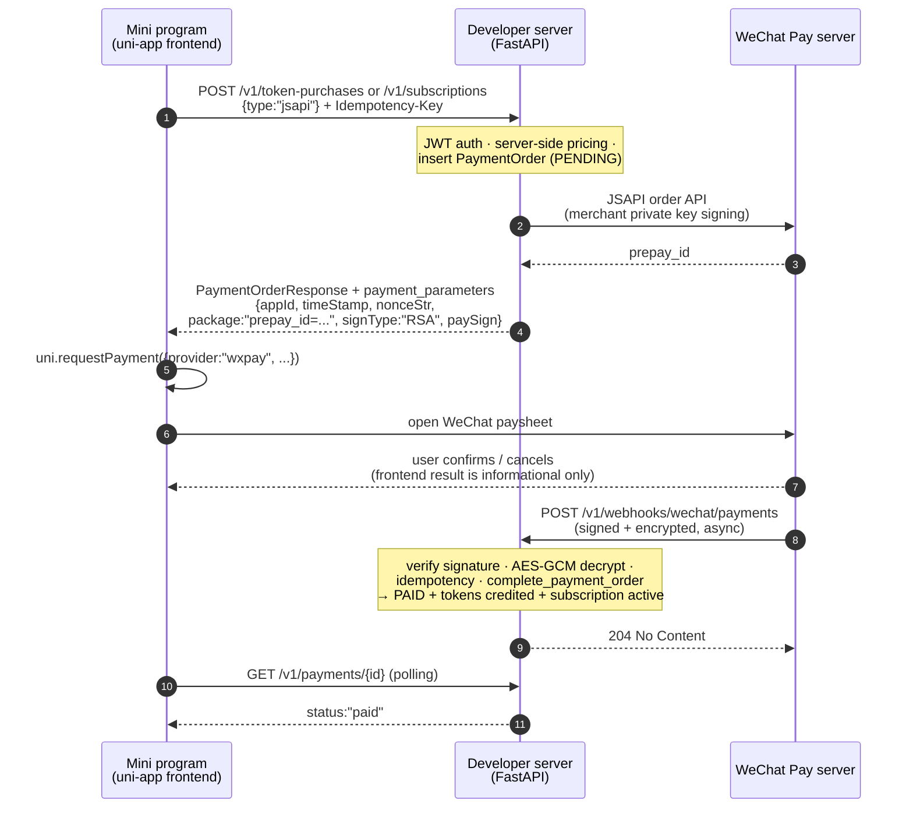

# Payment Flow (End-to-End)

This page traces the **full payment call chain** for buying tokens or a
subscription — from the billing page button in the mini program, through the
FastAPI backend, the WeChat Pay provider, the async webhook, and back to the
client. It is written for developers who are **new to WeChat Pay** and explains
how the frontend and backend cooperate at every step.

> **Also read**: [Douyin Payment Guide](/reference/douyin-payment) — how the
> same billing service will plug into Douyin Mini Program payment (planned).

---

## The big picture

The interaction below is the **official WeChat JSAPI (mini program) sequence**
(see the official diagrams in [Official documentation](#official-documentation)).
The three actors are the mini program frontend, the developer server (your
FastAPI), and the WeChat Pay server:



The rule to remember: **the backend is the only authority that credits
tokens**. The frontend never "decides" that a payment succeeded — it only
collects the UI result, while the backend waits for WeChat's signed callback
(or a server-side query) before granting entitlements.

### Code navigation map

The sequence diagram uses `autonumber`, so every **message** gets a visible
number (1–11); the gray `Note over BE` boxes are internal server work and are
**not numbered**. Each row below matches the numbered message in the diagram
one-to-one. "Where in code" uses the convention **`file → function` (line)**.

| Step | Message in diagram | What happens | Where in code |
|---|---|---|---|
| 1 | `MP→BE` POST `/v1/token-purchases` or `/v1/subscriptions` | User taps **Buy**; frontend builds the request with `Idempotency-Key` and sends it | Frontend: `src/pkg-account/pages/store/index.vue` → `runCheckout()` (L181); `src/pkg-account/repositories/purchaseRequest.ts` → `buildSubscriptionPurchaseRequest` (L74) / `buildTokenPurchaseRequest` (L83) → `executePurchaseRequest` (L92) |
| — | (Note over BE) | Backend receives it: JWT auth, server-side pricing, idempotency, insert `PaymentOrder` (PENDING) | `app/billing_api.py` → `create_subscription` (L517) / `create_token_purchase` (L653); helpers: `ensure_payment_mode` (L229), `checkout_openid` (L239), `serialize_billing_order_creation` (L198) |
| 2 | `BE→WX` JSAPI order API | Backend calls WeChat to create the transaction (merchant private key signing) | `app/wechat_pay.py` → `create_checkout` (L242) → SDK `pay()` → `POST /v3/pay/transactions/jsapi` |
| 3 | `WX→BE` prepay_id | WeChat returns the prepayment session id | inside `create_checkout` (same as step 2, return value) |
| 4 | `BE→MP` `payment_parameters` | Backend signs the **client** pay params and returns them | `app/wechat_pay.py` → `checkout_app_id` (L199), `_payment_parameters` (L208) |
| 5 | `MP→MP` `uni.requestPayment` | Frontend validates params and invokes the paysheet bridge | `src/pkg-account/services/payment.ts` → `requestWechatPayment` (L60) |
| 6 | `MP→WX` open paysheet | WeChat renders the user-facing paysheet | same as step 5 (internal to `uni.requestPayment`) |
| 7 | `WX→MP` confirm / cancel | User confirms or cancels — UI result only, not proof of payment | `requestWechatPayment` `success` / `fail` callbacks; `cancelled()` (L54) recognizes cancel |
| 8 | `WX→BE` webhook | WeChat posts the signed + encrypted result | entry: `app/billing_api.py` → `wechat_pay_notification` (L1408); verify + decrypt: `app/wechat_pay.py` → `callback` (L356) |
| 9 | `BE→WX` 204 | Backend acknowledges (idempotent) | end of `wechat_pay_notification` (L1408) — persists event, returns 204 |
| — | (Note over BE) | Backend settles: `complete_payment_order` → PAID + tokens credited | `app/billing.py` → `complete_payment_order` (L855) |
| 10 | `MP→BE` GET `/v1/payments/{id}` | Frontend polls until the order is `paid` | `src/pkg-account/repositories/paymentReconciliation.ts` → poller; applied in `store/index.vue` `applyOrder` (L178) |
| 11 | `BE→MP` `status:"paid"` | Poller receives the final state | same as step 10 (poller response) |
| M1 | — | Mock mode: simulate a successful payment (not in diagram) | `app/billing_api.py` → `mock_complete_payment` (L764) → reuses `complete_payment_order` |
| M2 | — | Mock mode: simulate a successful refund (not in diagram) | `app/billing_api.py` → `mock_complete_refund` (L1011) |

> Line numbers track the current `main` / `ui-integration` heads. Search for the
> function name if they drift.

---

## Part 1 — Frontend: preparing a purchase

### 1.1 The billing store page

`src/pkg-account/pages/store/index.vue` renders the token packages and plans
(fetched from `GET /v1/billing/catalog`). When the user taps **Buy**, the page
builds a *prepared purchase request*:

### 1.2 Prepared request with Idempotency-Key

`src/pkg-account/repositories/purchaseRequest.ts`:

- `buildSubscriptionPurchaseRequest(input)` → `POST /v1/subscriptions`
  with body `{ type: "jsapi", plan_code: "<code>" }`
- `buildTokenPurchaseRequest(input)` → `POST /v1/token-purchases`
  with body `{ type: "jsapi", package_code: "<code>" }`
- Both attach an `Idempotency-Key` header derived from
  `getOrCreateIdempotencyKey({ scope: "purchase", ownerId, actionId })`.
  The key is persisted locally so a retry reuses the **same** order instead of
  creating duplicates.
- The request body uses `type: "jsapi"` — the mini program only ever performs
  JSAPI checkout (see [JSAPI vs APP](#jsapi-vs-app) below).

`executePurchaseRequest` then validates the response strictly:
`order.kind` must match, `order.paymentType === "jsapi"`, and
`(status === "pending") === (paymentParameters !== null)` — otherwise the
response is rejected as malformed.

### 1.3 The payment bridge

`src/pkg-account/services/payment.ts` wraps `uni.requestPayment`:

```ts
uni.requestPayment({
  provider: "wxpay",   // WeChat Pay (the mini program's only provider today)
  timeStamp, nonceStr, package: "prepay_id=...",
  signType: "RSA", paySign,
  success: () => resolve(),
  fail:    (error) => reject(PaymentBridgeError(...)),
})
```

Before calling, it validates every field (numeric `timeStamp`, `nonceStr` ≤ 32
chars, `package` starting with `prepay_id=`, `signType === "RSA"`) and maps
failures to four codes: `PAYMENT_PARAMETERS_INVALID`, `PAYMENT_USER_CANCELLED`
(detected via the `cancel` errMsg), `PAYMENT_PROVIDER_FAILED`,
`PAYMENT_INVOCATION_FAILED`.

### 1.4 Polling for the result

`paymentReconciliation.ts` polls `GET /v1/payments/{id}` until the order
becomes `paid` (or fails). It also re-checks that the returned order still has
`paymentType === "jsapi"`. The mini program does **not** trust its own
`uni.requestPayment` success callback as proof of payment.

---

## Part 2 — Backend: creating the order and pay params

Both purchase endpoints live in `app/billing_api.py` and follow the same
flow (`create_subscription` at L517, `create_token_purchase` at L653):

```
1. get_current_user()                     → authenticated user (JWT)
2. ensure_payment_mode(settings)          → fail closed if WECHAT_PAY_MODE=disabled
3. checkout_openid(user, type)            → JSAPI requires user.wechat_openid
4. serialize_billing_order_creation       → advisory lock (per user)
5. idempotency check                      → same Idempotency-Key → reuse order
6. load active plan/package               → server-side pricing (never client price)
7. insert PaymentOrder (PENDING)          → out_trade_no, amount_fen, expires_at
8. payment_provider.create_checkout(...)  → WeChat prepay + signed client params
9. return PaymentOrderResponse + payment_parameters
```

### JSAPI vs APP (and what "virtual payment" means here)

`app/db_models.py` defines two checkout surfaces:

| `PaymentType` | WeChat surface | Who uses it |
|---|---|---|
| `jsapi` | `WeChatPayType.JSAPI` — **JSAPI order API** | **Enabled today** — every mini program checkout sends `type: "jsapi"` |
| `app` | `WeChatPayType.APP` — WeChat **Open Platform App** payment (for standalone native apps) | Implemented in `wechat_pay.py` but **not used by the mini program** |

The **official "mini program virtual payment"** (`requestVirtualPayment` for
iOS virtual goods) is a different capability and is **not integrated**.

### "JSAPI 支付" vs "小程序支付" — what the official product names mean

The WeChat Pay product center lists **JSAPI payment** and **mini program
payment** as two products, which is the source of the confusion. The official
docs ([小程序支付 产品介绍, V3](https://pay.weixin.qq.com/doc/v3/partner/4012085810))
state it precisely:

> JSAPI 支付与小程序支付共享同一权限及下单接口，但调起方式不同：JSAPI 需校验
> 调起支付的域名/路径与合作伙伴平台配置的「JSAPI支付授权目录」是否一致，
> 小程序不校验无需配置。

They are **the same API** (`POST /v3/pay/transactions/jsapi`) with **the same
merchant permission** — only the *invocation channel and configuration*
differ:

| | JSAPI 支付 | 小程序支付 |
|---|---|---|
| Scene | WeChat built-in browser / official-account pages (`wx.chooseWXPay`, `WeixinJSBridge`) | WeChat mini program (`wx.requestPayment`) |
| Authorized directory (授权目录) | Required — domain/path must match the configured directory | Not checked — nothing to configure |
| Order API | `POST /v3/pay/transactions/jsapi` | same |
| In this project | n/a | **what we use** — frontend `uni.requestPayment` (→ `wx.requestPayment`), backend `WeChatPayType.JSAPI` |

So the code sending `type: "jsapi"` is **not** a contradiction: `jsapi` names
the *interface family*; the *product scene* this mini program belongs to is
「小程序支付」.

### API V3 vs V2 — which one this project uses

| | API V2 | API V3 |
|---|---|---|
| Entry point | `https://api.mch.weixin.qq.com/pay/unifiedorder` (统一下单) | `https://api.mch.weixin.qq.com/v3/pay/transactions/jsapi` |
| Data format | XML | JSON |
| Signature | MD5 / HMAC-SHA256 | RSA-SHA256 (merchant private key) |
| Callback encryption | plaintext (sign only) | AES-256-GCM (API v3 key) + platform-certificate verification |
| Verification | API key | WeChat Pay platform certificate (serial checked against `Wechatpay-Serial`) |
| Status | **suspended for new merchants** (V2 SDK stopped maintenance on 2022-09-22; existing merchants keep using it, official deadline TBD) | **current standard** — what new merchants should use |

**This project uses API V3** end to end: the SDK (`wechatpayv3`) only talks to
V3 endpoints; callbacks are decrypted with the API v3 key and verified with the
platform public key (`WECHAT_PAY_PUBLIC_KEY` / `_ID`). The
[Official documentation](#official-documentation) section links both the V3
*developer guide* (current API names) and the V2 *product guide* (whose 时序图
is the clearest picture of the three-party interaction) — both describe the same
flow.

### Where the Python SDK comes from

The dependency is `wechatpayv3[async]==2.0.3` (`pyproject.toml`), imported as
`from wechatpayv3.async_ import AsyncWeChatPay, WeChatPayType` in
`app/wechat_pay.py`. It is the **official WeChat Pay Python SDK**, maintained
by WeChat Pay itself in the `wechatpay-apiv3` GitHub organization
([wechatpay-python](https://github.com/wechatpay-apiv3/wechatpay-python)) —
the same org publishes Java, Go, PHP, Node.js, C# and Ruby SDKs. The `async`
extra provides the `AsyncWeChatPay` client used by FastAPI.

### Creating the WeChat transaction

`app/wechat_pay.py — WeChatPayClient.create_checkout`:

1. Picks the AppID per payment type (JSAPI uses the mini program AppID
   `wxec0d577de41255aa`).
2. Calls the SDK `pay()` (wechatpayv3) with `out_trade_no`, `amount`
   (fen + currency), optional `payer.openid` (required for JSAPI),
   `time_expire` (derived from `WECHAT_PAYMENT_EXPIRE_SECONDS`, default 30 min)
   and `notify_url`.
3. WeChat returns `prepay_id`.
4. The backend signs the **client** parameters with the merchant private key:

   - **JSAPI**: `{ appId, timeStamp, nonceStr, package: "prepay_id=...", signType: "RSA", paySign }`
   - **APP**: `{ appId, partnerId, prepayId, package: "Sign=WXPay", nonceStr, timeStamp, sign }`

5. Returns these inside `PaymentOrderResponse.payment_parameters`.

The merchant credentials come from config (`WECHAT_PAY_MERCHANT_ID`,
`WECHAT_PAY_API_V3_KEY`, `WECHAT_PAY_MERCHANT_SERIAL`,
`WECHAT_PAY_MERCHANT_PRIVATE_KEY[_FILE]`, `WECHAT_PAY_PUBLIC_KEY[_FILE]`,
`WECHAT_PAY_PUBLIC_KEY_ID`, `WECHAT_PAYMENT_NOTIFY_URL`). The private key and
API v3 key are secrets — **never** shipped to the mini program.

---

## Part 3 — WeChat calls the backend (async webhook)

After the user pays, WeChat posts to
`POST /v1/webhooks/wechat/payments` (payments) and
`POST /v1/webhooks/wechat/refunds` (refunds) — both handled by
`wechat_pay_notification` in `app/billing_api.py` (L1408).

```
1. wechat_pay_mode == disabled  → 404
2. payment_provider.callback(headers, body)
     SDK verifies: Wechatpay-Timestamp fresh (≤5 min), Wechatpay-Serial matches
     the configured public key, signature valid; then AES-GCM decrypts the
     resource using the API v3 key.
     → 401 on any failure (WeChat will retry later)
3. Idempotency: event id already in wechat_payment_events → 204 (no re-processing)
4. Business checks: mchid == configured, appid == configured, amount == order
5. Branch:
   • payment event (out_trade_no):
     event_type == "TRANSACTION.SUCCESS" && trade_state == "SUCCESS"
     → complete_payment_order(...)
   • refund event (out_refund_no):
     REFUND.SUCCESS → complete_refund_order  (debits tokens)
     REFUND.ABNORMAL / REFUND.CLOSED → fail_refund_order
6. Persist WeChatPaymentEvent + return 204
```

### Settling a payment

`app/billing.py — complete_payment_order` (line ~855):

- Locks the user + order rows (`SELECT ... FOR UPDATE`).
- Idempotent: already `PAID`/`REFUNDED` → return unchanged; not `PENDING` → 409.
- Marks `status = PAID`, stores `wechat_transaction_id`, `paid_at`.
- **Credits tokens**: `user.remaining_tokens += tokens_granted`, inserts a
  `PurchasedTokenBatch` and a `TokenLedgerEntry` (idempotency key
  `payment:{order.id}:user:grant`).
- **Activates a subscription**: sets `current_period_start/end` from
  `add_subscription_interval`, status → `ACTIVE`.
- **Referral reward** (`create_referral_reward_for_payment`) is created only
  for real payments — skipped when `wechat_transaction_id` starts with `MOCK`.

> The frontend's `uni.requestPayment` success/fail is **informational only**;
> credit happens here, from the trusted signed callback.

---

## Part 4 — Mock payment: how it works and how to test without WeChat

### The principle

WeChat has **no official sandbox** for the mini program JSAPI flow, so the
project ships its own mock that *keeps every real code path*:

- In `WECHAT_PAY_MODE=mock`, `create_wechat_pay_client` constructs the **real
  wechatpayv3 SDK** (real signing, real verification, real encryption) and then
  swaps only the SDK's network gateway to `WECHAT_PAY_BASE_URL`
  (`http://mock-payment-provider:8081/mock/wechat-pay`).
- `mock-payment-provider` is a separate container (`docker-compose.yml`,
  profile `mock-wechat`) running `app.mock_payment_server:app`. It implements
  WeChat's API v3 shapes:

  | Fake endpoint | Behaviour |
  |---|---|
  | `POST /mock/wechat-pay/v3/pay/transactions/jsapi` | returns `{"prepay_id": "fake_<out_trade_no>"}` |
  | `POST /mock/wechat-pay/v3/pay/transactions/app` | same for APP checkout |
  | `POST .../out-trade-no/{no}/close` | 204, order must exist |
  | `GET .../out-trade-no/{no}?mchid=...` | **reads the local `payment_orders` row** and derives `trade_state`: PAID→`SUCCESS`, REFUNDED→`REFUND`, CLOSED/expired→`CLOSED`, else `NOTPAY` |
  | `POST /mock/wechat-pay/v3/refund/domestic/refunds` | returns fake `refund_id`, status `PROCESSING` |

- A `MockWeChatResponseSignatureMiddleware` signs every successful fake
  response with the **real merchant private key** (PKCS1v15 + SHA256) and adds
  `Wechatpay-Timestamp/Nonce/Signature/Serial/Signature-Type`, exactly like
  WeChat does. So the SDK's **verification path runs for real** against the
  mock — the only thing that is fake is the destination.

**So: does mock talk to WeChat servers?** No. There is **zero** network traffic
to `api.mch.weixin.qq.com` in mock mode. It talks only to the local
`mock-payment-provider` container, which *pretends* to be WeChat.

### How you can test the full payment function

Because the fake `query` endpoint derives state from the local database, you
drive the flow by changing the order's state — and the cleanest way is the
**mock completion endpoint** on the API process (enabled when
`MOCK_PAYMENT_ENDPOINTS_ENABLED=true`):

```
POST /mock/payments/{payment_order_id}/complete      (mock_complete_payment)
POST /mock/refunds/{refund_order_id}/complete        (mock_complete_refund)
```

These are authenticated (JWT, order must belong to the caller) and call the
**same production settlement functions** (`complete_payment_order`,
`complete_refund_order`) with a fake transaction id (`MOCK...`). That means:

1. Run the local stack (`docker compose --profile mock-wechat up`).
2. In the mini program, open the store, pick a package → the backend creates a
   real `payment_orders` row and returns fake pay params.
3. Trigger the webhook-equivalent with `POST /mock/payments/{id}/complete`
   (or, if you prefer, build a signed callback body yourself and POST it to
   `/v1/webhooks/wechat/payments` to exercise the webhook path).
4. Verify: `GET /v1/payments/{id}` → `status: "paid"`, tokens credited,
   subscription `active`.

The signed-verification path can additionally be exercised end to end because
the SDK still verifies the mock's signatures — a mismatch would raise
`WECHAT_PAY_CALLBACK_INVALID`.

---

## Order lifecycle

```
PENDING ──(TRANSACTION.SUCCESS callback / mock complete)──► PAID
   │                                                          │
   ├─(provider-confirmed close / expiry sweep)──► CLOSED    ├─(refund success)──► REFUNDED
   └─(expired: query reports CLOSED)                        └─(refund abnormal/closed)─► stays PAID, refund failed
```

Expired pending orders are swept by the `close_payment_orders` cron; a
`payment_reconciliation` job keeps local state aligned with WeChat's
`trade_state` via `query_payment_order` (which validates out_trade_no, mchid,
appid and amount).

## Data written

| Table | What |
| --- | --- |
| `payment_orders` | one row per purchase/subscription, `PENDING → PAID/CLOSED/REFUNDED` |
| `wechat_payment_events` | verified, deduplicated callback events (idempotency) |
| `purchased_token_batches` | token grant after PAID |
| `token_ledger_entries` | `TOKEN_PURCHASE` / `SUBSCRIPTION_PURCHASE` credit, refund debit |
| `user_subscriptions` | activated/renewed period on subscription payment |

## Official documentation

WeChat publishes the authoritative interaction diagrams and API references.
Bookmark these — the project's implementation mirrors them exactly:

| Topic | Official doc | What it contains |
|---|---|---|
| **JSAPI payment dev guide (V3)** | https://pay.weixin.qq.com/doc/v3/merchant/4012791870 | JSAPI/小程序下单 → 调起支付 → 支付结果通知 full sequence; `prepay_id` hand-off |
| **Mini program payment dev guide (V2)** | https://pay.weixin.qq.com/doc/v2/merchant/4011938514 | **业务流程时序图** for 小程序支付: 统一下单 → `wx.requestPayment` → 支付通知 → 查单 |
| **API v3 signing / verification / encryption** | https://pay.weixin.qq.com/doc/v3/merchant/4011938658 | How requests are signed with the merchant private key, how callbacks are verified and decrypted (AES-GCM, API v3 key) |
| **Payment result notification (回调)** | https://pay.weixin.qq.com/doc/v3/merchant/4011935834 | `TRANSACTION.SUCCESS` event payload, verification, retry rules, 204 acknowledgement |
| **Query order API (查单)** | https://pay.weixin.qq.com/doc/v3/merchant/4011938840 | Server-side order query as the backstop when callbacks are delayed/lost |
| **小程序登录 (wx.login → code2Session)** | https://developers.weixin.qq.com/miniprogram/dev/framework/open-ability/login.html | **官方登录时序图**: wx.login 取 code → 开发者服务端 code2Session → openid/session_key |
| **code2Session API** | https://developers.weixin.qq.com/miniprogram/dev/server/API/user-login/api_code2session | Server-side only; appid + secret + code → openid + session_key |
| **手机号快速验证 (getPhoneNumber)** | https://developers.weixin.qq.com/miniprogram/dev/framework/open-ability/getPhoneNumber.html | **官方时序图**: 前端按钮授权 → code → 服务端解密 phone number |

> The V2 guide's 时序图 (developers.weixin.qq.com / pay.weixin.qq.com) is the
> clearest picture of the three-party interaction; the V3 diagram in the JSAPI
> guide shows the same flow with the current API names. Our
> [mermaid diagram](#the-big-picture) above is a re-drawing of it with the
> project's actual endpoints.

## Related call chains

- [Douyin Payment Guide](/reference/douyin-payment) — planned Douyin integration
  (login exists; payment not yet implemented).
- [Design Job Lifecycle](/reference/flows/design-job-lifecycle) — where tokens
  are spent.
- [WeChat Login Flow](/reference/flows/wechat-login-flow) — JWT protects all
  billing routes; `wechat_openid` is required for JSAPI checkout.
- [Configuration Reference](/reference/configuration) — all `WECHAT_PAY_*` and
  `MOCK_PAYMENT_*` options.
