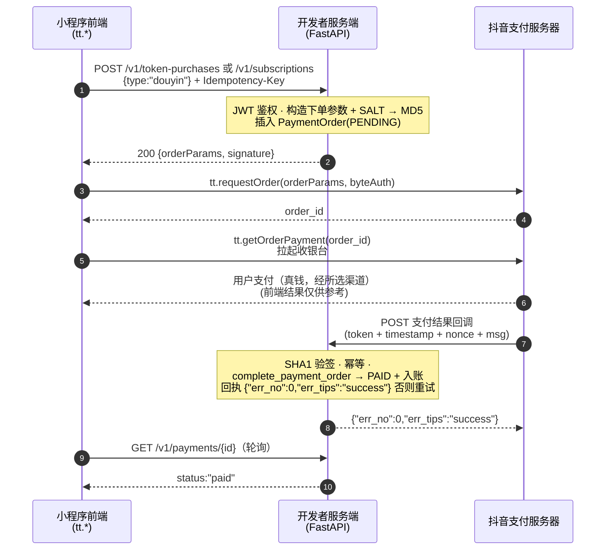
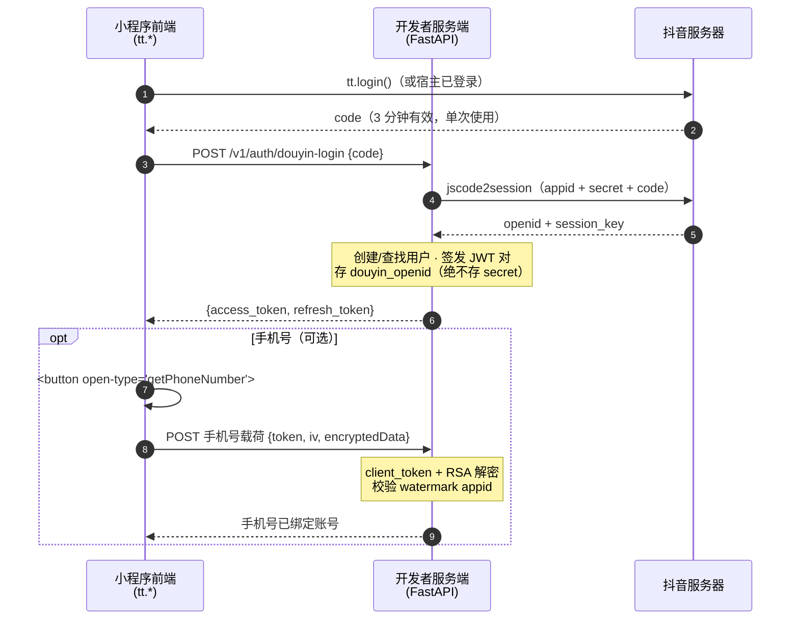

# 抖音支付接入指南（规划中）

本文写给要**把抖音小程序支付接到项目里**的团队成员：平台要先申请/配置什么、
抖音的"普通支付 vs 虚拟支付"概念和微信有什么不同、怎么 mock / 测试，以及
真实端到端流程。面向熟悉微信支付接入（见 [支付流程](/reference/flows/payment-flow)）
、需要抖音对等方案的开发者。

> **当前状态**：抖音**登录**已上线（后端 `app/douyin_auth.py`，路由
> `POST /v1/auth/douyin-login`；前端 `src/services/douyinAuth.ts`）。
> 抖音**支付尚未实现**：前端支付桥（`src/pkg-account/services/payment.ts`）
> 仍硬编码 `provider: "wxpay"`，后端没有任何抖音支付代码。

---

## 1. 抖音开放平台要申请/配置什么

抖音要求一整套前置条件到位，支付 API 才可能可用：

| # | 步骤 | 在哪做 | 说明 |
|---|---|---|---|
| 1 | 注册开发者 | developer.open-douyin.com | 已完成 |
| 2 | 创建小程序 | 开放平台控制台 | 已完成——AppID `ttd386a53b4dfe7bf501` |
| 3 | **主体认证** | 控制台 → 设置 | 企业认证；过期/缺失会**直接挡掉支付** |
| 4 | 完善基础信息 + **服务类目** | 控制台 | 类目决定交易准入；本项目是**工具**类小程序 |
| 5 | **交易准入** | 见"交易能力接入规范" | 类目必须在准入名单；同时关注**保证金**与**订单限额** |
| 6 | 选**支付解决方案**（进件方案） | 控制台 → 能力 → 支付 → 支付能力 | 选**企业版**（不涉及个人商户收款/分账）或**普通版**（涉及个人）；**进件后不可更改** |
| 7 | **进件开户** | 平台页面或 API | 企业版约 1–3 天，普通版约 5–7 天；抖音+微信+支付宝渠道一起提交，抖音本身无额外审核 |
| 8 | 拿**支付系统密钥 SALT** | 能力 → 支付 → 支付方式管理 → 支付设置 | 每个服务端请求都要用它做 MD5 签名。**绝不进客户端** |
| 9 | 申请**能力权限** | 能力 → 解决方案 → 交易类小程序通用 | 通用交易系统 OpenAPI、支付消息回调、退款消息回调、退款申请扩展点…（自动审批） |
| 10 | 配置**回调地址** | 控制台 → 开发 → 解决方案配置 | 抖音把支付/退款结果 POST 到的服务端地址；然后**发布上线** |

一句话：**工具**类目官方推荐走**通用交易系统（General Trading System）**。
进件没完成，支付下单直接失败（"未完成进件步骤无法进行支付下单"）。

## 2. 抖音的"普通支付"与"虚拟支付"

抖音和微信一样是双轨制，但边界**更严**：

### 现金支付 —— 普通路径

- 覆盖实物商品与**安卓端**虚拟商品。
- 实现于**担保支付**或**通用交易系统**——下单 → 收银台 → 回调 → 结算。
- 用户付的是真钱（进件时统一收集微信/支付宝/抖音支付渠道）。

### 虚拟支付 / 钻石兑换 —— iOS 虚拟商品

- 抖音官方规范（**小程序iOS虚拟支付规范**）明确：**iOS 不支持虚拟商品的
  现金支付**。解锁功能、会员、虚拟内容、虚拟币在 iOS 上**必须走钻石
  （Diamond）兑换**：用户先在自己抖音钱包充值钻石，小程序消耗钻石来
  兑换商品（10 钻石 = 1 元），安卓用 `tt.requestGamePayment`、iOS 用
  `tt.openAwemeCustomerService`（需开通 IM 客服能力）。
- iOS 上对虚拟商品做现金支付、甚至**只展示**购买按钮/价格而没有钻石通道，
  都属于违规，可能直接**封禁支付能力**。
- **对本项目很关键**：钻石兑换目前只开放**短剧/长视频/小说**类目，
  **工具类尚未开放**。也就是说——本项目的积分/会员都是虚拟商品，**现阶段
  iOS 用户没有合规支付通道**；要么 iOS 端隐藏购买入口，要么等钻石兑换
  对工具类开放。

### 和现有微信代码的映射

当前代码的 `PaymentType`（`app` | `jsapi`）以及"JSAPI 启用 / APP 后端就绪"
的划分都是**微信专用**的。抖音不复用这些枚举——后端需要自己的抖音支付
provider 与抖音订单模型（见 §5）。

## 3. Mock / 测试：复用微信 mock，还是用抖音沙箱？

**用抖音官方沙箱——不要复用微信 mock。**

| 维度 | 微信 mock（现有） | 抖音沙箱（官方） |
|---|---|---|
| 是什么 | 自建容器*假装*微信；SDK 网关替换、签名/验签保留 | 官方环境 `open-sandbox.douyin.com`，与生产完全隔离 |
| 搭建 | docker-compose profile `mock-wechat` + `WECHAT_PAY_BASE_URL` | 创建沙箱应用；进件忽略资质与审核 |
| 资金 | 无真实资金 | **无真实资金**；收银台可自选结果（成功/超时） |
| 回调 | 由 `/mock/payments/{id}/complete` 驱动 | 沙箱发真实形状的回调（仅一次、不重试） |
| 异常注入 | 无 | `Aweme-Negative-Test: <case>` 头（如 `MA_PAY_BAN`） |
| 数据保留 | 自己的 DB | 14 天；每周六 04:00 清理 |
| 客户端 | 普通开发者工具 | **必须用沙箱客户端**（不可分发） |

为什么不能复用微信 mock？两边线上协议完全不同——微信 API v3 是 JSON +
证书 RSA 签名；抖音是 SALT + MD5 请求签名、SALT + SHA1 回调验签、回执
`{err_no:0, err_tips:"success"}`。改造微信 mock 的成本和重写差不多。建议：

- **人工/联调测试** → 抖音沙箱（进件快、无真钱）。
- **CI 自动化** → 只有追求离线速度时才自建 mock：沿用微信 mock 的思路
  （真实签名路径、假目的地），但按抖音协议重写。
- 前端的"模拟支付"文案提示已就绪
  （`runtimeConfig.platform === "douyin" && paymentMode === "mock" → "模拟支付"`），
  等抖音 mock 桥接即可用。

## 4. 抖音真实支付流程（端到端）

抖音有两种形态；**通用交易系统**是工具类目官方推荐的。两者信任模型与微信
一致：服务端签名、客户端拉收银台、平台回调、服务端查询兜底。

### 4a. 通用交易系统 —— 推荐

这是**官方通用交易系统的标准时序**（平台自己的图见
[官方文档参考](#官方文档参考)）：

后端要做的事：

1. **预下单**：构造订单参数（sku/金额/多商户时带 `merchantUid`），用 SALT
   签名（非身份字段排序后用 `&` 拼接、末尾加 SALT 做 MD5）。交给
   `tt.requestOrder`，或应答平台的预下单扩展点。
2. **收银**：前端 `tt.getOrderPayment`（或用 `payment-channel-select` 组件
   出内置渠道列表；组件报错时回退到 `requestOrder + getOrderPayment`）。
3. **回调**：验签 `signature = SHA1(sorted(token, timestamp, nonce, msg))`；
   按订单 id 幂等处理；回 `{"err_no":0,"err_tips":"success"}`，否则平台重试。
   因为回调可能延迟/丢失，**以查询订单为最终真相**。
4. **退款**：发起退款 API + 退款结果回调；用户发起的退款还会走退款申请
   扩展点，可能要审核。
5. **结算**：非生服工具类支付 D+7（或带履约核销 D+3）。钱落在"在途资金 →
   可提现"；之后按月出结算单 + 开票 + 打款。
6. **对账**：获取交易账单 / 获取资金账单 API。

### 4b. 担保支付（备选，老形态）

服务端调 `POST https://developer.toutiao.com/api/apps/ecpay/v1/create_order`
（SALT 签名）拿 `order_id`；客户端 `tt.pay(orderId)` 拉起收银台。回调与查询
同一套信任模型。**二选一**——每笔订单不可混用。

### 4b.2 抖音登录与手机号（已上线，支付的前置）

登录是支付所需的身份前置。下图对照**官方小程序登录时序**（也见
[官方文档参考](#官方文档参考)）：

### 4c. iOS 虚拟商品（钻石路径，待开放）

用户先充值钻石，小程序调 `tt.requestGamePayment`（安卓）/
`tt.openAwemeCustomerService`（iOS），带 `currencyType: "DIAMOND"`、
`customId`（你的唯一订单号）、`extraInfo`；服务端收到支付结果回调后发放
商品。退款按钻石进行；结算单走独立的"收入结算 → 抖音钻石兑换"。

---

## 5. 后端工作量清单（给开发）

要落地抖音支付，后端需要（对照 `app/wechat_pay.py`）：

- **Provider 抽象**：新增 `DouyinPayClient`（SALT MD5 请求签名、SHA1 回调
  验签、下单/查询/退款），加一层路由让计费按收银面选择微信/抖音。
- **新配置**（`.env.example`）：`DOUYIN_PAY_MODE`（`disabled|mock|live`）、
  `DOUYIN_PAY_SALT`、`DOUYIN_PAY_NOTIFY_URL`、沙箱地址覆盖等。
  密钥一律不进小程序。
- **Webhook**：`POST /v1/webhooks/douyin/payments`（+ 退款），复用同一套
  幂等表模式（`WeChatPaymentEvent` 同款）与同一套结算函数
  （`complete_payment_order` / `complete_refund_order`）。
- **前端桥**：扩展 `payment.ts`，provider 按平台选择（微信 `wxpay`；抖音
  `tt.requestOrder + tt.getOrderPayment`），保留严格参数校验与错误归一。
- **iOS 门禁**：钻石兑换对工具类未开放期间，iOS 端隐藏/阻断购买入口，
  遵守 iOS 虚拟支付规范。

## 官方文档参考

抖音开放平台发布了权威的时序图与 API 文档。上面 [mermaid 时序图](#4a-通用交易系统--推荐)
都是对这些官方图的重绘：

| 主题 | 官方文档 | 内容 |
|---|---|---|
| **担保支付 接入准备 (TE)** | https://developer.open-douyin.com/docs/resource/zh-CN/mini-app/open-capacity/guaranteed-payment/TE | 前置条件全链：主体认证 → 服务类目 → 交易准入 → 保证金 → 进件 |
| **通用交易系统接入指引** | https://developer.open-douyin.com/docs/resource/zh-CN/mini-app/open-capacity/business-monetization/guaranteed-payment/general/basicapi | 进件/下单/回调/退款/结算 API 全集（当前推荐体系） |
| **整体架构及流程** | https://developer.open-douyin.com/docs/resource/zh-CN/mini-app/open-capacity/trade-system/old-version/ka-solution/architecture | **预下单 / 支付 / 退款 官方时序图**（实线=同步、虚线=异步） |
| **沙盒环境** | https://developer.open-douyin.com/docs/resource/zh-CN/mini-app/open-capacity/business-monetization/guaranteed-payment/sandbox | open-sandbox.douyin.com：免进件审核、无真钱、`Aweme-Negative-Test` 异常注入、14 天数据保留 |
| **组件与 API 清单** | https://developer.open-douyin.com/docs/resource/zh-CN/mini-app/open-capacity/business-monetization/guaranteed-payment/trade-system/general/apilist | `tt.requestOrder` / `tt.getOrderPayment` / 进件 / 退款 / 对账 API 名与参数 |
| **支付方式开通** | https://developer.open-douyin.com/docs/resource/zh-CN/mini-app/open-capacity/business-monetization/guaranteed-payment/trade-system/general/introduction | 企业版 vs 普通版方案选择（进件后不可改） |
| **进件（普通版）** | https://developer.open-douyin.com/m/docs/resource/zh-CN/mini-app/open-capacity/guaranteed-payment/guide/merchant | 控制台进件 vs 接口进件（服务商/批量） |
| **小程序登录（code2Session）** | https://developer.open-douyin.com/docs/resource/zh-CN/mini-app/develop/server/basic-abilities/log-in/code-2-session | code 3 分钟有效、单次使用、换 openid/session_key |
| **登录时序图 Codelab** | https://developer.open-douyin.com/docs/resource/zh-CN/codelabs/mini-app/microapp-login/notice | **官方登录 + getPhoneNumber 时序图**与可运行示例 |
| **获取手机号（新方式）** | https://developer.open-douyin.com/m/docs/resource/zh-CN/mini-app/develop/tutorial/open-capabilities/general-capabilities/new-phone-method | token/iv/encryptedData 服务端解密、watermark 校验 |

## 相关页面

- [支付流程（微信）](/reference/flows/payment-flow) —— 本指南所对应的已实现
  微信侧实现。
- [配置参考](/reference/configuration) —— 未来的 `DOUYIN_PAY_*` 配置项会
  在这里登记。
- [REST API 概览](/reference/rest-api) —— `POST /v1/auth/douyin-login`
  （已上线）与未来的支付路由。
