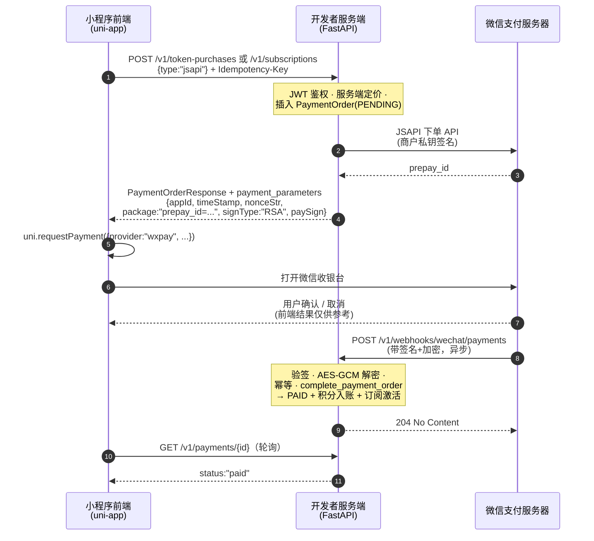

# 支付流程（端到端全链路）

本文从**用户在小程序账单页点下购买按钮**开始，一路追踪到 FastAPI 后端、
微信支付、异步回调、最终前端拿到结果——覆盖"买积分 / 买会员订阅"的完整
调用链。写给**对微信支付不熟**的开发者，讲清前后端每一步如何配合。

> **延伸阅读**：[抖音支付接入指南](/reference/douyin-payment)——同一套计费
> 服务未来如何接入抖音小程序支付（规划中）。

---

## 总览

下图是**微信官方 JSAPI（小程序）支付交互时序**（官方原图见
[官方文档参考](#官方文档参考)）。三个角色是：小程序前端、开发者服务端
（你的 FastAPI）、微信支付服务器：



记住一条铁律：**只有后端有权入账**。前端从不"判定"支付成功——它只收集
UI 结果，后端要等微信带签名的回调（或服务端主动查询）确认后，才发放权益。

### 代码导航表（Code navigation map）

下面每个 Step 编号与上面时序图一一对应。"代码位置"按
**`文件 → 函数`（行号）** 的格式书写，方便你直接从时序图跳到源码。

| Step | 哪一方 | 做什么 | 代码位置 |
|---|---|---|---|
| 1 | **小程序前端** | 用户在商店页点**购买** | `src/pkg-account/pages/store/index.vue` → `runCheckout()`（L181） |
| 2 | **小程序前端** | 构造带 `Idempotency-Key` 的购买请求 | `src/pkg-account/repositories/purchaseRequest.ts` → `buildSubscriptionPurchaseRequest`（L74）/ `buildTokenPurchaseRequest`（L83）→ `executePurchaseRequest`（L92） |
| 3 | **小程序前端** | 校验参数、拉起微信收银台 | `src/pkg-account/services/payment.ts` → `requestWechatPayment`（L60）→ `uni.requestPayment({ provider: "wxpay", ... })` |
| 4 | **开发者服务端** | JWT 鉴权、服务端定价、幂等、插入 `PaymentOrder`(PENDING) | `app/billing_api.py` → `create_subscription`（L517）/ `create_token_purchase`（L653）；辅助：`ensure_payment_mode`（L229）、`checkout_openid`（L239）、`serialize_billing_order_creation`（L198） |
| 5 | **开发者服务端** | 调微信 JSAPI 下单接口、签客户端支付参数 | `app/wechat_pay.py` → `create_checkout`（L242）；`checkout_app_id`（L199）、`_payment_parameters`（L208） |
| 6 | **小程序前端** | 用户确认 / 取消（仅 UI 结果） | 同 Step 3（`success` / `fail` 回调） |
| 7 | **微信服务器** | 异步回调开发者服务端 | `POST /v1/webhooks/wechat/payments` |
| 8 | **开发者服务端** | 验签、AES-GCM 解密、幂等、结算入账 | `app/billing_api.py` → `wechat_pay_notification`（L1408）；`app/wechat_pay.py` → `callback`（L356）；`app/billing.py` → `complete_payment_order`（L855） |
| 9 | **小程序前端** | 轮询直到 `status:"paid"` | `src/pkg-account/repositories/paymentReconciliation.ts` → poller；由 `store/index.vue` 的 `applyOrder`（L178）应用结果 |
| M1 | **开发者服务端** | Mock 模式：模拟支付成功 | `app/billing_api.py` → `mock_complete_payment`（L764）→ 复用 `complete_payment_order` |
| M2 | **开发者服务端** | Mock 模式：模拟退款成功 | `app/billing_api.py` → `mock_complete_refund`（L1011） |

> 行号对应当前 `main` / `ui-integration` 最新头；若版本漂移，直接搜函数名。

---

## 第 1 部分 — 前端：准备一笔购买

### 1.1 账单商店页

`src/pkg-account/pages/store/index.vue` 渲染积分包与套餐（数据来自
`GET /v1/billing/catalog`）。用户点**购买**后，页面构造一个 *prepared
purchase request*：

### 1.2 带幂等键的购买请求

`src/pkg-account/repositories/purchaseRequest.ts`：

- `buildSubscriptionPurchaseRequest(input)` → `POST /v1/subscriptions`
  body `{ type: "jsapi", plan_code: "<code>" }`
- `buildTokenPurchaseRequest(input)` → `POST /v1/token-purchases`
  body `{ type: "jsapi", package_code: "<code>" }`
- 两者都带 `Idempotency-Key` 头，由
  `getOrCreateIdempotencyKey({ scope: "purchase", ownerId, actionId })` 生成，
  本地持久化——重试会**复用同一笔订单**而不是重复创建。
- body 固定 `type: "jsapi"` —— 小程序只走 JSAPI 收银（见 [JSAPI 与 APP](#jsapi-与-app)）。

`executePurchaseRequest` 随后严格校验响应：`order.kind` 必须匹配、
`order.paymentType === "jsapi"`、`(status === "pending") === (paymentParameters !== null)`，
不满足即拒绝（防脏数据）。

### 1.3 支付桥

`src/pkg-account/services/payment.ts` 封装 `uni.requestPayment`：

```ts
uni.requestPayment({
  provider: "wxpay",   // 微信支付（小程序目前唯一的 provider）
  timeStamp, nonceStr, package: "prepay_id=...",
  signType: "RSA", paySign,
  success: () => resolve(),
  fail:    (error) => reject(PaymentBridgeError(...)),
})
```

调用前逐字段校验（`timeStamp` 纯数字、`nonceStr` ≤ 32 位、`package` 以
`prepay_id=` 开头、`signType === "RSA"`），失败归一为四类错误：
`PAYMENT_PARAMETERS_INVALID`、`PAYMENT_USER_CANCELLED`（通过 errMsg 含
cancel 识别）、`PAYMENT_PROVIDER_FAILED`、`PAYMENT_INVOCATION_FAILED`。

### 1.4 轮询拿结果

`paymentReconciliation.ts` 轮询 `GET /v1/payments/{id}`，直到订单变
`paid`（或失败），并再次校验返回订单 `paymentType === "jsapi"`。
小程序**不信任**自己 `uni.requestPayment` 的成功回调作为付款凭证。

---

## 第 2 部分 — 后端：建订单 + 生成支付参数

两个购买端点都在 `app/billing_api.py`，流程一致
（`create_subscription` 在 L517，`create_token_purchase` 在 L653）：

```
1. get_current_user()                     → 已登录用户（JWT）
2. ensure_payment_mode(settings)          → WECHAT_PAY_MODE=disabled 时直接失败
3. checkout_openid(user, type)            → JSAPI 必须要有 user.wechat_openid
4. serialize_billing_order_creation       → 每用户一把 advisory lock
5. 幂等检查                               → 同 Idempotency-Key → 复用旧订单
6. 加载有效套餐/积分包                    → 价格一律服务端定价（不信任客户端）
7. 插入 PaymentOrder（PENDING）           → out_trade_no、amount_fen、expires_at
8. payment_provider.create_checkout(...)  → 微信预支付 + 客户端签名参数
9. 返回 PaymentOrderResponse + payment_parameters
```

### JSAPI 与 APP（以及"虚拟支付"在这里指什么）

`app/db_models.py` 定义两种收银面：

| `PaymentType` | 微信面 | 谁在用 |
|---|---|---|
| `jsapi` | `WeChatPayType.JSAPI` —— **JSAPI 下单接口** | **当前启用**——小程序每次购买都发 `type: "jsapi"` |
| `app` | `WeChatPayType.APP` —— 微信**开放平台 App 支付**（独立原生 App 用） | `wechat_pay.py` 里已实现，但**小程序不调用** |

微信官方的"**小程序虚拟支付**"（面向 iOS 虚拟商品的
`requestVirtualPayment`）是另一套能力，本项目**未接入**。如果你在代码里
听到"普通支付 vs 虚拟支付"，指的就是上面 `jsapi`（启用）vs `app`
（后端就绪、前端未启用）的差异。

### "JSAPI 支付" 与 "小程序支付" —— 官方产品名到底指什么

微信支付产品中心把 **JSAPI 支付** 和 **小程序支付** 列为两个产品，这就是
困惑的来源。官方文档（[小程序支付 产品介绍, V3](https://pay.weixin.qq.com/doc/v3/partner/4012085810)）
说得非常明确：

> JSAPI 支付与小程序支付共享同一权限及下单接口，但调起方式不同：JSAPI 需校验
> 调起支付的域名/路径与合作伙伴平台配置的「JSAPI支付授权目录」是否一致，
> 小程序不校验无需配置。

也就是说，两者**是同一个接口**（`POST /v3/pay/transactions/jsapi`）、**同一
个商户权限**，区别只在*调起渠道和配置*：

| | JSAPI 支付 | 小程序支付 |
|---|---|---|
| 场景 | 微信内置浏览器 / 公众号页面（`wx.chooseWXPay`、`WeixinJSBridge`） | 微信小程序（`wx.requestPayment`） |
| 授权目录 | 必须校验——域名/路径需与平台配置的「JSAPI 支付授权目录」一致 | 不校验、无需配置 |
| 下单接口 | `POST /v3/pay/transactions/jsapi` | 同一个 |
| 本项目 | 未用 | **用的就是它**——前端 `uni.requestPayment`（底层 `wx.requestPayment`），后端 `WeChatPayType.JSAPI` |

所以代码里发 `type: "jsapi"` **并不矛盾**：`jsapi` 是*接口族*的名字；本项目
所属的*产品场景*是「小程序支付」。

### API V3 与 V2 —— 本项目用的是哪个

| | API V2 | API V3 |
|---|---|---|
| 入口 | `https://api.mch.weixin.qq.com/pay/unifiedorder`（统一下单） | `https://api.mch.weixin.qq.com/v3/pay/transactions/jsapi` |
| 数据格式 | XML | JSON |
| 签名 | MD5 / HMAC-SHA256 | RSA-SHA256（商户私钥） |
| 回调加密 | 明文（仅签名） | AES-256-GCM（APIv3 密钥）+ 平台证书验签 |
| 验签 | API key | 微信支付平台证书（`Wechatpay-Serial` 校验） |
| 状态 | **新商户已暂停接入**（V2 SDK 2022-09-22 起停止维护；存量商户仍可用，官方下线时间待定） | **现行标准**——新商户应使用 |

**本项目全程用 API V3**：SDK（`wechatpayv3`）只对接 V3 端点；回调用 APIv3
密钥解密、用平台公钥（`WECHAT_PAY_PUBLIC_KEY` / `_ID`）验签。上文
[官方文档参考](#官方文档参考) 里同时放了 V3 *开发指引*（现行 API 命名）和
V2 *产品指引*（其时序图是三方可视化最清晰的一版）——两者描述的是同一个
流程。

### Python SDK 是哪来的

依赖是 `wechatpayv3[async]==2.0.3`（`pyproject.toml`），在
`app/wechat_pay.py` 中 `from wechatpayv3.async_ import AsyncWeChatPay, WeChatPayType`
引入。这是**微信支付官方的 Python SDK**，由微信支付团队在
`wechatpay-apiv3` GitHub 组织下维护
（[wechatpay-python](https://github.com/wechatpay-apiv3/wechatpay-python)）——
同一组织还发布 Java、Go、PHP、Node.js、C#、Ruby 等官方 SDK。`async` extra
提供 FastAPI 使用的 `AsyncWeChatPay` 客户端。

### 创建微信交易

`app/wechat_pay.py — WeChatPayClient.create_checkout`：

1. 按支付类型选 AppID（JSAPI 用小程序 AppID `wxec0d577de41255aa`）。
2. 调 SDK `pay()`（wechatpayv3），带 `out_trade_no`、`amount`
   （分 + 币种）、`payer.openid`（JSAPI 必填）、`time_expire`
   （由 `WECHAT_PAYMENT_EXPIRE_SECONDS` 推导，默认 30 分钟）、`notify_url`。
3. 微信返回 `prepay_id`。
4. 后端用商户私钥对**客户端**参数签名：

   - **JSAPI**：`{ appId, timeStamp, nonceStr, package: "prepay_id=...", signType: "RSA", paySign }`
   - **APP**：`{ appId, partnerId, prepayId, package: "Sign=WXPay", nonceStr, timeStamp, sign }`

5. 放入 `PaymentOrderResponse.payment_parameters` 返回。

商户凭据来自配置（`WECHAT_PAY_MERCHANT_ID`、`WECHAT_PAY_API_V3_KEY`、
`WECHAT_PAY_MERCHANT_SERIAL`、`WECHAT_PAY_MERCHANT_PRIVATE_KEY[_FILE]`、
`WECHAT_PAY_PUBLIC_KEY[_FILE]`、`WECHAT_PAY_PUBLIC_KEY_ID`、
`WECHAT_PAYMENT_NOTIFY_URL`）。私钥与 APIv3 密钥是机密——**绝不**进入小程序。

---

## 第 3 部分 — 微信回调后端（异步）

用户付完款，微信 POST 到
`POST /v1/webhooks/wechat/payments`（支付）和
`POST /v1/webhooks/wechat/refunds`（退款）——都由 `billing_api.py` 的
`wechat_pay_notification`（L1408）处理：

```
1. wechat_pay_mode == disabled  → 404
2. payment_provider.callback(headers, body)
     SDK 校验：Wechatpay-Timestamp 新鲜（≤5 分钟）、Wechatpay-Serial 匹配
     配置的公钥、签名有效；再用 APIv3 密钥对 resource 做 AES-GCM 解密。
     任何失败 → 401（微信会稍后重试）
3. 幂等：event id 已存在于 wechat_payment_events → 204（不重复处理）
4. 业务校验：mchid 匹配、appid 匹配、金额 == 订单金额
5. 分派：
   • 支付事件（out_trade_no）：
     event_type == "TRANSACTION.SUCCESS" 且 trade_state == "SUCCESS"
     → complete_payment_order(...)
   • 退款事件（out_refund_no）：
     REFUND.SUCCESS → complete_refund_order（扣回积分）
     REFUND.ABNORMAL / REFUND.CLOSED → fail_refund_order
6. 落库 WeChatPaymentEvent + 返回 204
```

### 结算一笔支付

`app/billing.py — complete_payment_order`（~855 行）：

- 锁用户与订单行（`SELECT ... FOR UPDATE`）。
- 幂等：已是 `PAID`/`REFUNDED` → 原样返回；不是 `PENDING` → 409。
- 标记 `status = PAID`，写入 `wechat_transaction_id`、`paid_at`。
- **入账积分**：`user.remaining_tokens += tokens_granted`，插
  `PurchasedTokenBatch` 与 `TokenLedgerEntry`（幂等键
  `payment:{order.id}:user:grant`）。
- **激活订阅**：按 `add_subscription_interval` 设
  `current_period_start/end`，状态 → `ACTIVE`。
- **推荐奖励**（`create_referral_reward_for_payment`）只对真实支付生效——
  `wechat_transaction_id` 以 `MOCK` 开头时跳过。

> 前端 `uni.requestPayment` 的 success/fail **仅供参考**；入账在这里发生，
> 依据是带签名的可信回调。

---

## 第 4 部分 — Mock 支付：原理，以及没有微信也能测

### 原理

微信对小程序 JSAPI 流程**没有官方沙箱**，所以项目自带一套 mock，它
**保留全部真实代码路径**：

- `WECHAT_PAY_MODE=mock` 时，`create_wechat_pay_client` 构造**真实
  wechatpayv3 SDK**（真实签名、真实验签、真实加解密），然后只把 SDK 的网络
  网关替换为 `WECHAT_PAY_BASE_URL`
  （`http://mock-payment-provider:8081/mock/wechat-pay`）。
- `mock-payment-provider` 是独立容器（`docker-compose.yml`，profile
  `mock-wechat`），跑 `app.mock_payment_server:app`，按微信 API v3 的协议
  形状实现：

  | 假端点 | 行为 |
  |---|---|
  | `POST /mock/wechat-pay/v3/pay/transactions/jsapi` | 返回 `{"prepay_id": "fake_<out_trade_no>"}` |
  | `POST /mock/wechat-pay/v3/pay/transactions/app` | APP 收银同款 |
  | `POST .../out-trade-no/{no}/close` | 204，订单必须存在 |
  | `GET .../out-trade-no/{no}?mchid=...` | **读本地 `payment_orders` 行推导状态**：PAID→`SUCCESS`、REFUNDED→`REFUND`、CLOSED/过期→`CLOSED`、否则 `NOTPAY` |
  | `POST /mock/wechat-pay/v3/refund/domestic/refunds` | 返回假 `refund_id`、状态 `PROCESSING` |

- `MockWeChatResponseSignatureMiddleware` 给每个成功的假响应用**真实商户
  私钥**签名（PKCS1v15 + SHA256），并加
  `Wechatpay-Timestamp/Nonce/Signature/Serial/Signature-Type` 头，和微信
  一模一样。于是 SDK 的**验签路径对 mock 真跑**——假的只是目的地。

**所以：mock 会跟微信服务器交互吗？** 不会。mock 模式下**对
`api.mch.weixin.qq.com` 零网络流量**，只和本地 `mock-payment-provider`
容器通信——它*假装*自己是微信。

### 那怎么把支付功能测通？

因为假查询端点是从本地数据库推导状态的，驱动流程的办法是改订单状态——
最干净的方式是 API 进程上的 **mock 完成端点**（需
`MOCK_PAYMENT_ENDPOINTS_ENABLED=true`）：

```
POST /mock/payments/{payment_order_id}/complete      （mock_complete_payment）
POST /mock/refunds/{refund_order_id}/complete        （mock_complete_refund）
```

这两个端点带 JWT 鉴权（订单必须属于调用者），并且调用**与生产同一套结算
函数**（`complete_payment_order`、`complete_refund_order`），只是
transaction id 用假值（`MOCK...`）。于是：

1. 起本地栈（`docker compose --profile mock-wechat up`）。
2. 小程序打开商店选一个包 → 后端建真实 `payment_orders` 行、返回假支付参数。
3. 触发"微信回调等价物"：`POST /mock/payments/{id}/complete`
   （或者你想练 webhook 路径，也可以自己拼一个带签名的回调体 POST 到
   `/v1/webhooks/wechat/payments`）。
4. 验证：`GET /v1/payments/{id}` → `status: "paid"`，积分已入账，
   订阅 `active`。

签名验签路径还能被完整端到端锻炼——SDK 仍然会验证 mock 的签名，不一致会
抛 `WECHAT_PAY_CALLBACK_INVALID`。

---

## 订单生命周期

```
PENDING ──(TRANSACTION.SUCCESS 回调 / mock complete)──► PAID
   │                                                      │
   ├─(provider 确认关闭 / 过期清扫)──► CLOSED            ├─(退款成功)──► REFUNDED
   └─(过期：query 报 CLOSED)                             └─(退款异常/关闭)─► 保持 PAID，退款失败
```

过期的 PENDING 订单由 `close_payment_orders` cron 清扫；`payment_reconciliation`
任务通过 `query_payment_order`（会校验 out_trade_no、mchid、appid、金额）
让本地状态与微信 `trade_state` 对齐。

## 落库数据

| 表 | 内容 |
| --- | --- |
| `payment_orders` | 每笔购买/订阅一行，`PENDING → PAID/CLOSED/REFUNDED` |
| `wechat_payment_events` | 验签后、去重过的回调事件（幂等依据） |
| `purchased_token_batches` | PAID 后的积分发放批次 |
| `token_ledger_entries` | `TOKEN_PURCHASE` / `SUBSCRIPTION_PURCHASE` 入账、退款扣回 |
| `user_subscriptions` | 订阅支付后激活/续期 |

## 官方文档参考

微信官方发布了权威的交互时序图与 API 文档，建议收藏——本项目的实现与它们
完全一致：

| 主题 | 官方文档 | 内容 |
|---|---|---|
| **JSAPI 支付开发指引（V3）** | https://pay.weixin.qq.com/doc/v3/merchant/4012791870 | JSAPI/小程序下单 → 调起支付 → 支付结果通知 完整时序；`prepay_id` 交接 |
| **小程序支付开发指引（V2）** | https://pay.weixin.qq.com/doc/v2/merchant/4011938514 | **小程序支付业务流程时序图**：统一下单 → `wx.requestPayment` → 支付通知 → 查单 |
| **API v3 签名/验签/加密** | https://pay.weixin.qq.com/doc/v3/merchant/4011938658 | 请求如何用商户私钥签名、回调如何验签并用 APIv3 密钥 AES-GCM 解密 |
| **支付结果通知（回调）** | https://pay.weixin.qq.com/doc/v3/merchant/4011935834 | `TRANSACTION.SUCCESS` 事件载荷、验签、重试规则、204 回执 |
| **查询订单 API（查单）** | https://pay.weixin.qq.com/doc/v3/merchant/4011938840 | 服务端主动查单，作为回调延迟/丢失的兜底 |
| **小程序登录（wx.login → code2Session）** | https://developers.weixin.qq.com/miniprogram/dev/framework/open-ability/login.html | **官方登录时序图**：wx.login 取 code → 开发者服务端 code2Session → openid/session_key |
| **code2Session API** | https://developers.weixin.qq.com/miniprogram/dev/server/API/user-login/api_code2session | 仅服务端调用；appid + secret + code → openid + session_key |
| **手机号快速验证（getPhoneNumber）** | https://developers.weixin.qq.com/miniprogram/dev/framework/open-ability/getPhoneNumber.html | **官方时序图**：前端按钮授权 → code → 服务端解密手机号 |

> V2 指引里的时序图是三方交互最直观的版本；V3 JSAPI 指引里的图是同一流程
> 的现行 API 命名版。上面 [mermaid 时序图](#总览) 是按本项目真实端点对它
> 的重绘。

## 相关调用链

- [抖音支付接入指南](/reference/douyin-payment) —— 规划中的抖音接入
  （登录已实现，支付未实现）。
- [设计作业生命周期](/reference/flows/design-job-lifecycle) —— 积分花在哪里。
- [微信登录流程](/reference/flows/wechat-login-flow) —— JWT 保护全部计费
  路由；JSAPI 收银需要 `wechat_openid`。
- [配置参考](/reference/configuration) —— 全部 `WECHAT_PAY_*` 与
  `MOCK_PAYMENT_*` 选项。
